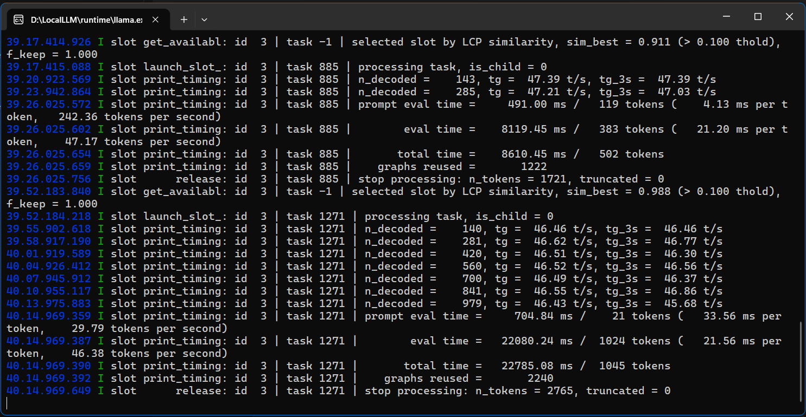
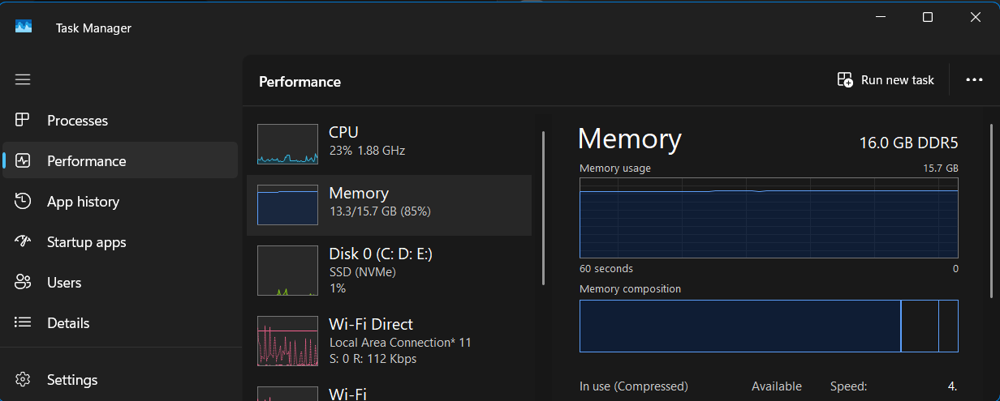

# My Own GPT — Built on Gemma (Local LLM)

## Overview

This project shows that you don't need OpenAI or a cloud subscription to have your own personal "GPT." Using Google's open-weight **Gemma** models, you can run a capable chatbot entirely on a normal consumer laptop — no internet required after setup, no API costs, and full privacy since everything runs locally.

This repo/README documents my setup, the hardware it runs on, and real response-time benchmarks so others can see what to expect before trying it themselves.

## Models Used

| Model | Parameters | Notes |
|---|---|---|
| Gemma 3 4B | 4B | Lightweight, fast for everyday Q&A |
| Gemma 3 4B E4B | 4B (efficient variant) | Optimized variant, tested for comparison |

## Hardware Specs

| Component | Spec |
|---|---|
| CPU | Intel Core i5, 12th Gen |
| RAM | 16 GB DDR5 |
| GPU | RTX 3050, 4 GB VRAM |
| OS | Windows 11 |

> This setup is a normal mid-range gaming/productivity laptop — nothing exotic. The point is to show this is achievable on hardware most people already own.

## How It's Built

Unlike most "run an LLM locally" tutorials, this isn't Ollama/LM Studio with a stock chat UI — it's a **fully custom interface** built from scratch:

- **Backend:** Flask + Flask-SQLAlchemy + Flask-CORS, served via `waitress` (production-grade WSGI server)
- **Frontend:** Custom HTML/CSS/JS (`templates/`, `static/`)
- **Model handling:** `model_manager.py` loads and runs the Gemma model files directly (downloaded manually — no Ollama/LM Studio dependency)
- **Chat history/storage:** `database.py`
- **Config:** `config.py`
- **Desktop app packaging:** `desktop.py` wraps the Flask app into a standalone desktop application (with its own icon, `localgpt.ico`) — so it runs like a native app instead of "open browser, go to localhost"

Repo: [github.com/charanachanta2/LocalGPT](https://github.com/charanachanta2/LocalGPT)

## Prerequisites

Before setting this up, make sure you have:

- Python 3.x installed
- A laptop/desktop with at least 8GB RAM (16GB recommended for smoother performance)
- ~5-10GB free disk space per model
- *(GPU optional — CPU-only works but will be slower)*
- The Gemma model files downloaded (not via Ollama — placed directly wherever `model_manager.py` expects them)

## Setup

```bash
# 1. Clone the repo
git clone https://github.com/charanachanta2/LocalGPT.git
cd LocalGPT

# 2. Install dependencies
pip install -r requirements.txt

# 3. (Add here: where to place the downloaded Gemma model files,
#     and any config.py values that need updating — model path, port, etc.)

# 4. Run the app
python app.py

# — OR, to run it as a standalone desktop app —
python desktop.py
```

### Step-by-Step (detailed)

1. Download the Gemma 3 4B / 4B E4B model files *(add source — e.g. Hugging Face link, and file format used, e.g. GGUF)*
2. Place the model files in *(the folder/path your `model_manager.py` expects)*
3. Update `config.py` with *(model path, port number, any other settings)*
4. Install dependencies with `pip install -r requirements.txt`
5. Run `python app.py` for the web interface (served via waitress) — or `python desktop.py` to launch it as a native desktop window

## Performance Benchmarks

Response times measured on the hardware above. "Simple question" = general knowledge/factual queries. "Code generation" = requests to write a function/script.

| Task Type | Example Prompt | Avg. Response Time |
|---|---|---|
| Simple factual question | "What is the capital of France?" | 1–2 seconds |
| Basic math | "What is 45 * 12?" | 3 seconds |
| Short summarization | "Summarize this paragraph in 2 lines: ..." | 1 second |
| Translation | "Translate 'Good morning' to French" | 1 second |
| Reasoning/logic question | "If a train leaves at 3pm going 60mph..." | 6 seconds (model asked a clarifying question before answering) |
| Creative writing | "Write a 4-line poem about the ocean" | 2 seconds |
| Code debugging | "Fix this broken Python function: ..." | 1 second to respond it needed the code, then 3 seconds to fix it once provided |
| Long-form explanation | "Explain how photosynthesis works" | 12 seconds |
| Code generation | "Write a Python function to reverse a string" | ~15 seconds |
| Code generation | "Write a program to check Armstrong number" | 11 seconds |

### Technical Performance Stats (from llama.cpp server logs)

Captured directly from the local inference server during testing:

| Metric | Value |
|---|---|
| Prompt eval speed | ~242 tokens/sec |
| Text generation speed | ~46–47 tokens/sec |
| Total tokens generated (longer response) | 1024 tokens in ~22 seconds |
| Context reused across turns | Yes (graph/KV cache reuse observed, e.g. "graphs reused = 2240") |



### System Resource Usage During Inference

RAM usage while the model was actively running, captured via Task Manager:

| Metric | Value |
|---|---|
| Total RAM | 16.0 GB DDR5 |
| RAM in use | 13.3 / 15.7 GB (~85%) |
| CPU usage | ~23% (1.88 GHz) |



> **Note:** With 4B-parameter models, RAM usage sits close to the ceiling of a 16GB system. Running other heavy applications alongside the model can cause slowdowns or swapping.


- Each prompt run **3 times**, average taken
- Timer started when prompt submitted, stopped when full response finished streaming
- Fresh session for each test (no prior context in the chat)
- Model: 4B

### Observations

- Basic Q&A is fast enough to feel conversational (1–2s).
- Code generation takes noticeably longer (~15s), likely due to longer, more structured output and higher token count rather than model complexity itself.
- Performance is naturally capped by the 4GB VRAM — larger models or longer contexts would be slower or may not fit at all.

## Model Comparison: Gemma 3 4B vs Gemma 3 4B E4B

| Metric | Gemma 3 4B | Gemma 3 4B E4B |
|---|---|---|
| Avg. simple Q&A time | 2 seconds | 5 seconds |
| Avg. code gen time | 10 seconds | 15 seconds |
| RAM usage (idle) | ~70% | ~75% |
| RAM usage (during inference) | 85–87% | 87–93% |
| Output quality (subjective) | Good for faster responses | Good for smarter, more useful answers |

## Why This Matters

You don't need expensive hardware or a paid subscription to run your own AI assistant. With open models like Gemma and tools like Ollama/LM Studio, anyone with a decent laptop can set up a private, offline GPT-style assistant in minutes.

## Use Cases

What you can realistically use this local GPT for:

- Quick factual lookups without needing internet
- Drafting emails, notes, or short writing
- Learning to code / getting quick code snippets
- Private conversations you don't want sent to the cloud
- Offline assistant while traveling or in low-connectivity areas

## Limitations

Be upfront about these — it builds trust with readers:

- Not as accurate or broad-knowledge as GPT-4/Claude/Gemini (much smaller model)
- Slower on complex tasks (code, long reasoning) as shown in benchmarks above
- Knowledge cutoff is fixed — no internet access, no live/current info
- Limited context window compared to large cloud models
- 4GB VRAM caps how large a model you can comfortably run

## Frequently Asked Questions

**Q: Do I need a GPU to run this?**
Yes, if you want to get faster answers.

**Q: How much does this cost to run?**
Free after initial setup — no API fees, runs entirely offline on your own hardware.

**Q: Can I use a different model instead of Gemma?**
Yes, as long as `model_manager.py` supports the format/loader for that model. Gemma was chosen here because *(your reason — e.g. good balance of speed/quality for this hardware)*.

**Q: Is my data private?**
Yes — since it runs fully locally, nothing is sent to any external server.

## Future Improvements

- Benchmark larger Gemma variants (9B, 27B) if hardware allows
- Try quantized versions for faster inference
- Add a proper latency-logging script for consistent benchmarking

## Contributing

If others want to try this and share their own benchmark numbers on different hardware, feel free to open a PR or issue with:
- Your hardware specs
- Model + quantization used
- Response times for the same test prompts above

This will help build a broader picture of what's realistically achievable on consumer hardware.

## License

This project is licensed under the [MIT License](LICENSE) — see the LICENSE file for details.
